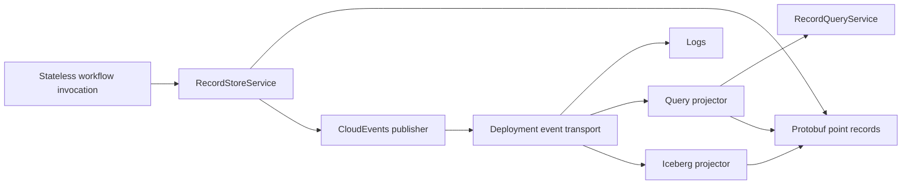

# CloudEvents and downstream projections

Temporaless emits [CNCF CloudEvents 1.0](https://github.com/cloudevents/spec/blob/v1.0.2/cloudevents/spec.md)
through optional Go and Python `RecordStoreService` server interceptors.
Downstream consumers own operational logs, indexes, and analytical tables.
The workflow runtime continues to use protobuf point records on OpenDAL.

Iceberg is the preferred convention for downstream analytical tables. It is
optional: applications choose their event transport, sink, catalog, and
partition transforms. No broker, database, or lake catalog enters core replay.

## What ships

- [`adapters/go/cloudevents`](../adapters/go/cloudevents): `NewInterceptor(Options)`.
- [`adapters/py/cloudevents`](../adapters/py/cloudevents): `RecordStoreInterceptor(Options)`.

Both use the official CloudEvents SDK. Supply a stable absolute producer URI `source`, an
application-owned observation-ID factory, and a publisher callback. Mount the
interceptor on the record-store **server**, after authorization. All writes
that need observations must pass through that server. Local direct stores can
remain serverless, but do not automatically publish events.

The callback sends to your existing event receiver, durable queue, or telemetry
bridge. It must bound its I/O, handle concurrent calls, and retain the same
CloudEvent on delivery retries. Publication is awaited in the storage RPC;
there is no detached background task that disappears when the process exits.
See the adapter READMEs for wiring.

## Envelope contract

These events are **record invalidations observed after successful RPCs**.
They do not assert that a value changed, that a claim was acquired, or that a
workflow completed. In particular, `TryCreateClaim(created=false)`, duplicate
`DeliverEvent`, and deleting an absent record can still produce observations.

| Attribute | Convention |
|---|---|
| `specversion` | `1.0` |
| `source` | Caller-supplied absolute URI identifying the record-store producer scope |
| `id` | Caller-supplied new ID for this observation, unique within `source`; no surrounding whitespace or control characters |
| `type` | Generated protobuf method full name, such as `temporaless.v1.RecordStoreService.PutWorkflow` |
| `datacontenttype` | `application/protobuf` |
| `dataschema` | `https://type.googleapis.com/` followed by the generated key message full name; a schema identifier, not a hosted descriptor endpoint |
| `data` | Deterministic protobuf binary of the typed key, with unknown fields removed |
| `time` | Optional SDK observation time; never a mutation revision |

The framework does not generate application workflow, run, activity, timer,
claim-owner, or incoming event IDs. The observation ID is distinct from a
workflow `EventKey.event_id`; allocate it in the application callback.

| Observed RPCs | Data message |
|---|---|
| `PutWorkflow`, `DeleteWorkflow`, `DeleteRun` | `temporaless.v1.WorkflowKey` |
| `PutActivity`, `DeleteActivity` | `temporaless.v1.ActivityKey` |
| `PutTimer`, `DeleteTimer` | `temporaless.v1.TimerKey` |
| `PutEvent`, `DeliverEvent`, `DeleteEvent` | `temporaless.v1.EventKey` |
| `TryCreateClaim`, `DeleteClaim` | `temporaless.v1.ClaimKey` |

`DeleteRun` invalidates the entire run, including its child records. Consumers
read the protobuf key; they never parse an object path to recover identity.
The event contains no workflow input, result, annotation, signal payload, or
claim owner. Record keys themselves may identify tenants or business objects;
route them under the deployment's existing authorization policy.

For [HTTP binary mode](https://github.com/cloudevents/spec/blob/v1.0.2/cloudevents/bindings/http-protocol-binding.md),
the protobuf bytes are the body and CloudEvents attributes are headers. The
SDK also supports the standard structured JSON envelope, which represents
these bytes as `data_base64`. That transport envelope does not change the
protobuf-only framework storage convention. A downstream receiver that accepts
only JSON object data needs an application-owned schema-aware translator; do
not silently serialize arbitrary `Any` payloads as JSON.

## Delivery and recovery

A successful storage mutation happens before publication. A publisher error
is logged and the successful RPC stays successful. A process crash,
cancellation, a failed RPC after a partial commit, or an out-of-band writer
can leave a durable record without an observation. Reads do not publish;
internal timer-ledger repairs and query-service sweeps are not covered by
these interceptors. Run retention through observed point RPCs when possible,
and reconcile every writer and deletion path.

This is a best-effort feed. CloudEvents specifies an event format, not durable
delivery, exactly-once processing, or ordering. The `outbox` helper elsewhere
in this repository only derives an external side-effect idempotency key; it
is not a publication journal. Neither retrying a callback nor adding a durable
broker closes the crash window between the object commit and publication.

For reliable current-state indexes:

1. Deduplicate transport redeliveries by `(source, id)`.
2. Treat each observation as an invalidation and re-read authoritative state.
   A delayed delete observation may refer to a record that now exists again.
3. Serialize reconciliation per identity or use a real comparable source
   revision. Event IDs, content digests, and observation times do not establish
   update/delete/recreate order.
4. Commit the downstream result before acknowledging transport delivery.
5. Periodically reconcile a bounded authoritative inventory to repair missed
   observations and deletions. Reconciliation must include newly created runs,
   so an inventory consisting only of already-indexed keys is insufficient.

Snapshot reconciliation recovers current state, not every overwritten
transition. A complete audit history requires a separately designed durable
mutation journal or backend change capture with proven commit/delivery
semantics. That capability is not shipped and must not be inferred from this
adapter. Application action/audit events and ordinary request logs can share
the same transport while retaining their own schemas and guarantees.

## Downstream responsibilities

`RecordQueryService` remains the backend-neutral interactive query boundary.
A projector may use ClickHouse or another index; it must hydrate selected
records from the point store and recheck filters before serving or deleting.
The due-timer ledger remains authoritative even when a projection is delayed.

Batch analytical projections into Iceberg, keeping typed identity, source
metadata, and lossless protobuf bytes when archival recovery requires them.
A receiver/queue outage affects observation delivery; a lake or query outage
must not become a dependency of replay. Monitor publish errors, transport
backlog, projection lag, and reconciliation progress independently.

The bundled SQLite index is an optional local reference. Its direct index
updates are not the production event architecture. No ClickHouse or Iceberg
projector is bundled. Backend ordering, hydration, pagination, tombstones, and
archive-before-delete requirements are specified in
[`clickhouse-iceberg.md`](clickhouse-iceberg.md).
